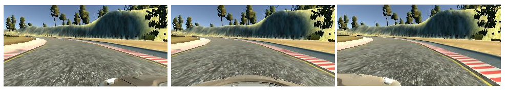
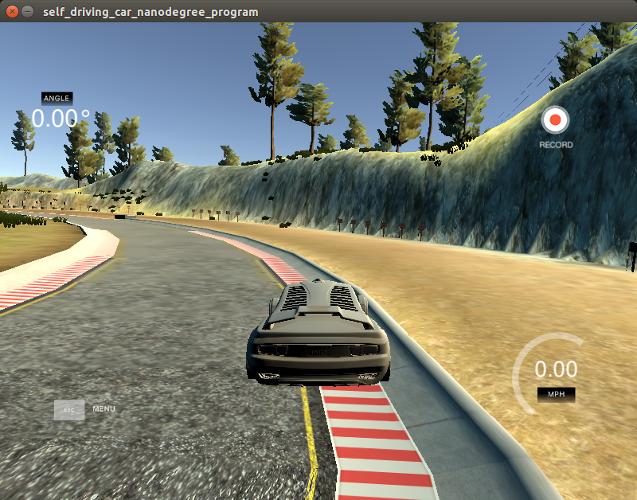
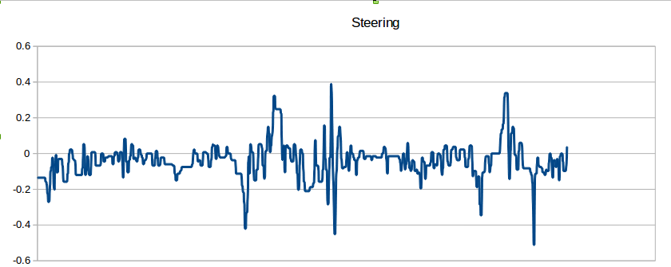

#**Behavioral Cloning** 

---

## Behavioral Cloning Project

The goals / steps of this project are the following:
* Use the simulator to collect data of good driving behavior
* Build, a convolution neural network in Keras that predicts steering angles from images
* Train and validate the model with a training and validation set
* Test that the model successfully drives around track one without leaving the road
* Summarize the results with a written report

[//]: # (Image References)

[image1]: ./examples/placeholder.png "Model Visualization"
[image2]: ./examples/placeholder.png "Grayscaling"
[image3]: ./examples/placeholder_small.png "Recovery Image"
[image4]: ./examples/placeholder_small.png "Recovery Image"
[image5]: ./examples/placeholder_small.png "Recovery Image"
[image6]: ./examples/placeholder_small.png "Normal Image"
[image7]: ./examples/placeholder_small.png "Flipped Image"

---

My project includes the following files:

* utills.py including the collection of functions that I used. 
* behavioral_cloning.py containing the script to create and train the model 
* drive.py for driving the car in autonomous mode
* model.h5 containing a trained convolution neural network 
* writeup.md summarizing the results

## Model Architecture and Training Strategy

### Exploring the Training Set

#### Training Set
I have used the training set provided by udacity for the first track. Also I captured data by driving in the first Track. Udacity provided 28056 frames (including center, right and left camera) and I have added almost 28000 frames to it.

I have used 2 strategies in collecting data:

1- Driving at the center of the lane by using mouse: Althought it was easier to use keyboard, but steering commands from keyboard don't seem to be continues or they jump from 0 to Max or Min value very quickly. However, changes in steering commands from mouse are smooth.

2- I have added many frames starting from the corner of the lane and moving the car toward th ecenter of the lane. These frame were mainly captured to help the network to learn how get back to the center of the lane.

NOTE: An important point is that cv2 images should be converted to RGB by using COLOR_BGR2RGB. 

 

 

#### Right and Left Cameras
I have also used images from right and left cameras by applying a correction factor to the steering value. I tried several settings for the correction factor and 0.3 gave a good result.

#### Data Augmentation
I haved flipped all the frames as recommended during the course to train my network in a generalized situation (Turining right and left).

### Data Preprocessing
I used two strategies to preprocess the training data set:

* 1- Normalization: I normalized all the training sets by by using keras.layers.lamda as recomended in the corse
* 2- Image cropping: I cropped the top and bottom of the frames (70 rows from the top and 25 rows from the bottom) to get rid of the distracting pixels. I have also explored the idea of reshaping/rescaling the image to 50x50 (in cv2), but it didn't result in any improvement even if it seems to be a better input, so I removed the reshaping and rescaling block.

I have noticed that some people preprocess the steering values as well since they might have two much jittering in their numbers. Since I used mouse to capture training data set, I beleave that my steering numbers are quite smooth so I didn't apply any filter on steering values. 

 

#### Validation Set
I finally, randomly shuffled the data set and put 20% of the data into a validation set. I used this training data for training the model. The validation set helped determine if the model was over or under fitting. 

### Model Architecture
I have started with an Architecture similar to NVIDIA paper and I fine tune it. I used 5 epochs since after that I didn't see that much improvement. Here is the architecture that I finaly used:

##### Preprocessing Layer:
* Layer 1: Lambda for Normalization. Input = 160x320x3. Output = 160x320x3
* Layer 1:Cropping2D. Input = 160x320x3. Output = 65x320x3

##### Layers
* Layer 1: Convolutional. (6, 5, 5) 
* Activation: Relu
* MaxPooling2D 
* Layer 2: Convolutional. (6, 5, 5) 
* Activation: Relu
* MaxPooling2D 
* Layer 3: Convolutional. (6, 5, 5) 
* Activation: Relu
* MaxPooling2D 
* Flatten 
* Layer 4: Dense (1164) 
* Layer 5: Dense (100) 
* Layer 6: Dense (50) 
* Layer 7: Dense (10) 
* Layer 8: Dense (1) 

### Results
I have tested the result of the training in the simulation and driving is quite smooth on the fist track. Initially, I set the speed to 9 (default speed) and it worked well. The result is still smooth if you increase the speed to 20. The video in the folder captured at the velocity of 10.

### Leasson learned
  * Number of data set: It is important to use higher number of data set. Only by using the data set provided by udacity, I couldn't train th enetwork. Actually, I am not sure about the quality of the data.
  * GPU: It was my first time running that I trained a network on GPU and CPU so I could compare teh training speed. I certainly helped alot.
  * Existing Architecture: For the begineers, it's a good practice to start from an existing network and then fine tune it base on the application.
  * Recovery data set: Adding recovery from left and right corners was very helpfull. 
 

As A future work, I will train the same network on Track 2 to check it's performance.

